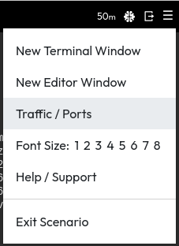
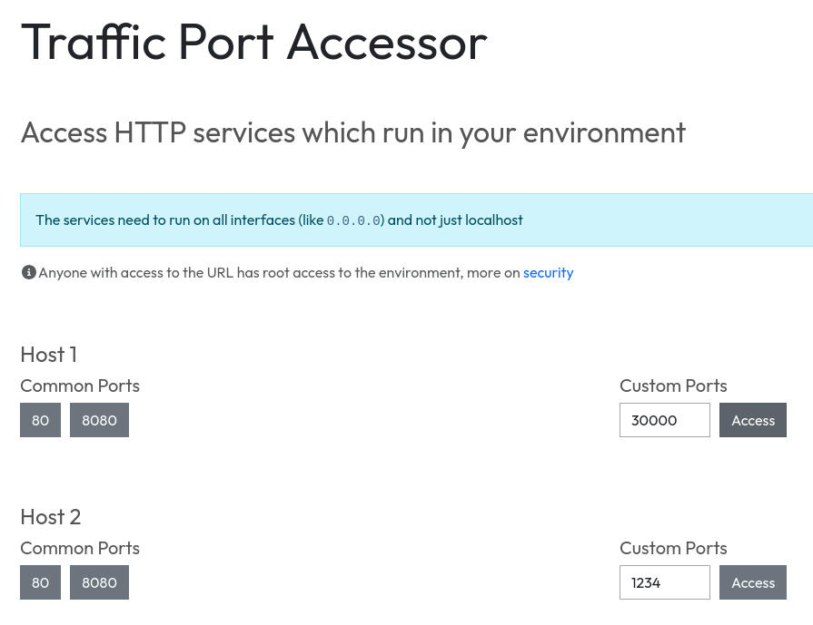
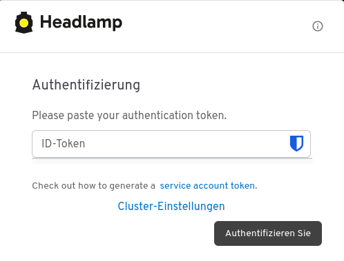
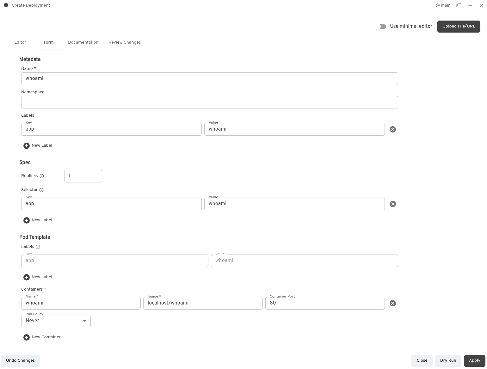

# Playbook Hands-On

## Übersicht

- Kubernetes Cluster mit 1 Control-plane (schedulable) und 1 Worker node (node01)
- Quellcode von Github auschecken und auf dem Worker node lokal einen Container damit bauen
- Headlamp im cluster installieren, um zu sehen was los ist
- Das gebaute Image im Cluster deployen und skalieren


## Detaillierter Ablauf

### A. Container Image lokal auf Worker node bauen

1) Auf https://killercoda.com anmelden - via Github oder Google Account, Alternativ via Email
2) Kubernetes Playground starten: https://killercoda.com/playgrounds/scenario/kubernetes, Hinweis: 60 min Timer startet
3) Default Einstiegspunkt ist eine bash shell auf `controlplane`
4) Zweiten Tab öffnen und in Shell auf `node01` wie folgt wechseln:
    ```bash
    ssh node01
    ```
    Ergebnis: Tab 2 zeigt nun `root@node01:~$`

5) In Tab 2 (`node01`) [nerdctl](https://github.com/containerd/nerdctl) und [BuildKit](https://github.com/moby/buildkit) mit folgendem Kommando installieren:
    ```bash
    curl -fsSL https://raw.githubusercontent.com/digitalchange-eu/it-experts/main/buildkit.sh | sudo bash
    ```
6) Code auschecken und in das Verzeichnis wechseln:
    ```bash
    git clone https://github.com/traefik/whoami.git && cd whoami
    ```
7) Container lokal bauen und in den lokalen Kubernetes container namespace (k8s.io) pushen:
    ```bash
    nerdctl -n k8s.io build -t localhost/whoami .
    ```

**Ergebnis: Image `localhost/whoami` ist auf Worker `node01` verfügbar**

### B. Kubernetes UI (Headlamp) installieren und verwenden

1) Auf die controlplane (Tab 1) wechseln
2) [Headlamp](https://headlamp.dev/) mit folgendem Befehl installieren:
    ```bash
    curl -fsSL https://raw.githubusercontent.com/digitalchange-eu/it-experts/main/headlamp.sh | bash
    ```
    Hinweis: Im Zuge der Installation wird der Admin ID-Token ausgegeben.
3) Anhand des Outputs prüfen ob Container läuft
4) In Killercoda rechts oben auf das ☰ Menü klicken und `Traffic / Ports` anwählen:

    
5) Bei `Host 1` oder `Host 2` Port `30000` eingeben und `Access`anklicken:
    
6) Es öffnet sich die Headlamp UI in einem separaten Tab. Zum Anmelden den ID-Token, beginnend mit `eyJh...`, aus Tab 1 kopieren und im Anmeldefenster einfügen:

    

**Ergebnis: Cluster kann in Headlamp "erforscht" werden**

### C. Eigenes Image im Cluster deployen und skalieren

1) Vor dem Deployment muss der Node `controlplane` "abgesperrt" werden, da dort das Image nicht verfügbar ist:
    ```bash
    kubectl cordon controlplane
    ```
2) Danach kann das `whoami` Deployment grafisch erstellt werden:

    

3) Ereignisse in Headlamp verfolgen
4) Pod logs in Headlamp ansehen -> **Erkenntnis: Container läuft**
5) Dann das Service via Kommandozeile in Tab 1 (controlplane) deployen:
    ```bash
    kubectl create service nodeport whoami --node-port=30080 --tcp=80:80`
    ```
5) Via Killercoda ☰ Menü `Traffic / Ports` bei einem der beiden Hosts Port `30080` eingeben und anwählen.
6) Es öffnet sich der Response des `whoami` Webservers in einem separaten Tab
7) Welche Hosts und IP-Adressen werden bei Browser-Reload angezeigt -> **Erkenntnis: Immer die selbe**
8) Deployment in Headlamp skalieren 1 -> 3
9) Erneut auf den `whoami` Webserver Tab im Browser zugreifen
10) Welche Hosts und IP-Adressen werden bei Browser-Reload angezeigt -> **Erkenntnis: Hosts und IP-Adressen rotieren = Demonstration des Loadbalancers**
11) Einzelne Pods in Headlamp löschen -> **Erkenntnis: Pods werden sofort ersetzt**

Optional:

13) Via Tab 2 wieder auf `node01` wechseln und `htop` ausführen und nach `/whoami` suchen -> **Erkenntnis: Container sind einfach nur drei Linux-Prozesse**

**Ergebnis: Hochverfügbare Bereitstellung eines selbstgebauten Container-Images**
